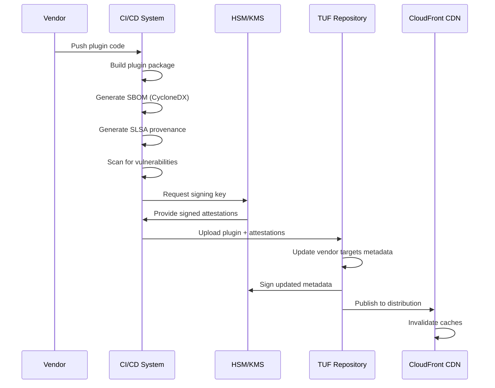
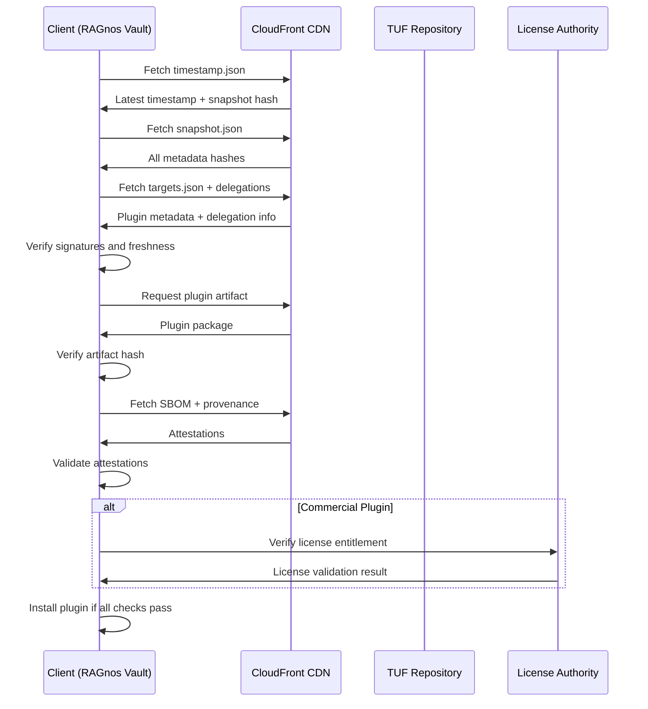

# RAGnos Vault TUF Metadata Structure and Hub Design

## Executive Summary

This document defines the TUF (The Update Framework) metadata structure and Hub architecture for RAGnos Vault's secure plugin distribution system. The design implements comprehensive supply chain security with enterprise-grade features including federated mirrors, air-gap support, vendor delegations, and license policy enforcement.

**Key Features**:
- Hierarchical delegation model with vendor namespaces
- Consistent snapshots for atomic updates
- SBOM and SLSA provenance integration
- Commercial plugin licensing support
- Air-gap and federated deployment ready

## 1. TUF Repository Architecture

### 1.1 Role Hierarchy

```
root (3-of-5 offline keys, 12-month expiry)
├── timestamp (online HSM, 24h expiry)
├── snapshot (online HSM, 7d expiry)
├── targets (2-of-3 offline keys, 90d expiry)
│   ├── vendors/* (terminating delegations)
│   │   ├── ragnos/* (official RAGnos plugins)
│   │   ├── enterprise/* (enterprise partner plugins)
│   │   ├── community/* (community verified plugins)
│   │   └── {vendor-name}/* (third-party vendor spaces)
│   ├── attestations/* (SLSA provenance and SBOMs)
│   └── metadata/* (registry metadata and indices)
└── enterprise-overlay (customer-managed, optional)
```

### 1.2 Repository Structure

```
repository/
├── metadata/                    # TUF metadata files
│   ├── root.json               # Root keys and role definitions
│   ├── timestamp.json          # Latest snapshot hash with timestamp
│   ├── snapshot.json           # All metadata file hashes
│   ├── targets.json            # Main targets delegation
│   └── delegations/            # Delegated role metadata
│       ├── vendors/
│       │   ├── ragnos.json
│       │   ├── enterprise.json
│       │   └── {vendor}.json
│       ├── attestations.json
│       └── metadata.json
└── targets/                     # Actual plugin files and artifacts
    ├── plugins/                 # Plugin distributions
    │   ├── ragnos/
    │   │   ├── openai-provider.1.2.3.tar.gz
    │   │   └── anthropic-provider.2.1.0.tar.gz
    │   ├── enterprise/
    │   └── community/
    ├── attestations/            # SLSA provenance and SBOMs
    │   ├── sboms/
    │   │   └── openai-provider.1.2.3.sbom.json
    │   └── provenance/
    │       └── openai-provider.1.2.3.provenance.json
    └── metadata/                # Registry indices and catalogs
        ├── plugin-index.json
        ├── vendor-registry.json
        └── compatibility-matrix.json
```

## 2. Metadata Schema Definitions

### 2.1 Root Metadata

```json
{
  "signed": {
    "_type": "root",
    "spec_version": "1.0.0",
    "version": 1,
    "expires": "2026-01-14T00:00:00Z",
    "keys": {
      "ed25519_root_key_1": {
        "keytype": "ed25519",
        "scheme": "ed25519",
        "keyval": {"public": "..."}
      },
      "ecdsa_p256_online_key_1": {
        "keytype": "ecdsa",
        "scheme": "ecdsa-sha2-nistp256",
        "keyval": {"public": "..."}
      }
    },
    "roles": {
      "root": {
        "keyids": ["root_key_1", "root_key_2", "root_key_3"],
        "threshold": 3
      },
      "timestamp": {
        "keyids": ["timestamp_key_1"],
        "threshold": 1
      },
      "snapshot": {
        "keyids": ["snapshot_key_1", "snapshot_key_2"],
        "threshold": 1
      },
      "targets": {
        "keyids": ["targets_key_1", "targets_key_2"],
        "threshold": 2
      }
    },
    "consistent_snapshot": true,
    "custom": {
      "ragnos": {
        "repository_type": "plugin_distribution",
        "supported_formats": ["tar.gz", "zip"],
        "license_verification": true,
        "sbom_required": true
      }
    }
  },
  "signatures": [
    {
      "keyid": "root_key_1",
      "signature": "..."
    }
  ]
}
```

### 2.2 Targets Metadata (Main)

```json
{
  "signed": {
    "_type": "targets",
    "spec_version": "1.0.0",
    "version": 1,
    "expires": "2025-04-14T00:00:00Z",
    "targets": {},
    "delegations": {
      "keys": {
        "vendor_ragnos_key": {
          "keytype": "ecdsa",
          "scheme": "ecdsa-sha2-nistp256",
          "keyval": {"public": "..."}
        }
      },
      "roles": [
        {
          "name": "vendors/ragnos",
          "keyids": ["vendor_ragnos_key"],
          "threshold": 1,
          "terminating": true,
          "paths": ["plugins/ragnos/*"],
          "custom": {
            "vendor_info": {
              "name": "RAGnos Labs",
              "email": "security@ragnos.io",
              "verification_level": "official",
              "license_authority": true
            }
          }
        },
        {
          "name": "vendors/enterprise",
          "keyids": ["enterprise_key"],
          "threshold": 2,
          "terminating": true,
          "paths": ["plugins/enterprise/*"],
          "custom": {
            "enterprise_features": {
              "customer_delegation": true,
              "private_plugins": true,
              "support_tier": "enterprise"
            }
          }
        },
        {
          "name": "attestations",
          "keyids": ["attestation_key"],
          "threshold": 1,
          "terminating": false,
          "paths": ["attestations/*"],
          "custom": {
            "attestation_types": ["sbom", "provenance", "vulnerability"]
          }
        }
      ]
    },
    "custom": {
      "repository_metadata": {
        "plugin_count": 150,
        "last_updated": "2025-01-14T12:00:00Z",
        "supported_transports": ["http", "sdk"],
        "policy_version": "2.0.0"
      }
    }
  },
  "signatures": [...]
}
```

### 2.3 Vendor Delegation (Example: RAGnos)

```json
{
  "signed": {
    "_type": "targets",
    "spec_version": "1.0.0",
    "version": 5,
    "expires": "2025-04-14T00:00:00Z",
    "targets": {
      "plugins/ragnos/openai-provider.1.2.3.tar.gz": {
        "length": 1024000,
        "hashes": {
          "sha256": "abc123...",
          "sha512": "def456..."
        },
        "custom": {
          "plugin_metadata": {
            "id": "openai-provider",
            "version": "1.2.3",
            "transport": "http",
            "vendor": "ragnos",
            "license": "MIT",
            "requires_license": false,
            "manifest_hash": "sha256:...",
            "sbom_path": "attestations/sboms/openai-provider.1.2.3.sbom.json",
            "provenance_path": "attestations/provenance/openai-provider.1.2.3.provenance.json",
            "compatibility": {
              "ragnos_vault": ">=2.0.0",
              "node": ">=16.0.0"
            }
          }
        }
      },
      "plugins/ragnos/anthropic-provider.2.1.0.tar.gz": {
        "length": 896000,
        "hashes": {
          "sha256": "ghi789...",
          "sha512": "jkl012..."
        },
        "custom": {
          "plugin_metadata": {
            "id": "anthropic-provider",
            "version": "2.1.0",
            "transport": "sdk",
            "vendor": "ragnos",
            "license": "Commercial",
            "requires_license": true,
            "license_verification_url": "https://licensing.ragnos.io/verify",
            "manifest_hash": "sha256:...",
            "sbom_path": "attestations/sboms/anthropic-provider.2.1.0.sbom.json",
            "provenance_path": "attestations/provenance/anthropic-provider.2.1.0.provenance.json",
            "entitlement_required": true,
            "features": ["premium", "enterprise"],
            "compatibility": {
              "ragnos_vault": ">=2.1.0",
              "node": ">=18.0.0"
            }
          }
        }
      }
    },
    "custom": {
      "vendor_metadata": {
        "vendor_id": "ragnos",
        "display_name": "RAGnos Labs",
        "contact": "security@ragnos.io",
        "website": "https://ragnos.io",
        "verification_status": "official",
        "key_rotation_policy": "annual",
        "supported_license_types": ["MIT", "Apache-2.0", "Commercial"],
        "plugin_signing": true,
        "last_key_rotation": "2024-01-14T00:00:00Z"
      }
    }
  },
  "signatures": [
    {
      "keyid": "vendor_ragnos_key",
      "signature": "..."
    }
  ]
}
```

### 2.4 Attestations Delegation

```json
{
  "signed": {
    "_type": "targets",
    "spec_version": "1.0.0",
    "version": 3,
    "expires": "2025-04-14T00:00:00Z",
    "targets": {
      "attestations/sboms/openai-provider.1.2.3.sbom.json": {
        "length": 50000,
        "hashes": {
          "sha256": "sbom123...",
          "sha512": "sbom456..."
        },
        "custom": {
          "attestation_metadata": {
            "type": "sbom",
            "format": "cyclonedx",
            "version": "1.5",
            "target_artifact": "plugins/ragnos/openai-provider.1.2.3.tar.gz",
            "generation_tool": "cdxgen",
            "generation_time": "2025-01-14T10:00:00Z",
            "component_count": 125,
            "vulnerability_scan": "clean"
          }
        }
      },
      "attestations/provenance/openai-provider.1.2.3.provenance.json": {
        "length": 25000,
        "hashes": {
          "sha256": "prov789...",
          "sha512": "prov012..."
        },
        "custom": {
          "attestation_metadata": {
            "type": "provenance",
            "format": "slsa_v1",
            "target_artifact": "plugins/ragnos/openai-provider.1.2.3.tar.gz",
            "build_platform": "github_actions",
            "build_level": "slsa_level_3",
            "builder": "ragnos-labs/plugin-builder@v2.1.0",
            "source_repo": "https://github.com/ragnos-labs/openai-provider",
            "source_commit": "abc123def456...",
            "reproducible": true
          }
        }
      }
    },
    "custom": {
      "attestation_policy": {
        "sbom_required": true,
        "provenance_required": true,
        "vulnerability_scanning": "required",
        "license_scanning": "required",
        "signature_verification": "required"
      }
    }
  },
  "signatures": [...]
}
```

## 3. Plugin Distribution Workflow

### 3.1 Plugin Publication Process



### 3.2 Plugin Installation Process



## 4. Federation and Enterprise Features

### 4.1 Enterprise Overlay Structure

```json
{
  "enterprise_policy": {
    "organization_id": "enterprise-corp",
    "policy_version": "1.0.0",
    "vendor_allowlist": ["ragnos", "trusted-vendor"],
    "plugin_allowlist": ["openai-provider", "internal-plugin"],
    "license_requirements": {
      "commercial_allowed": true,
      "gpl_blocked": true,
      "approval_required": ["AGPL", "Copyleft"]
    },
    "security_requirements": {
      "vulnerability_threshold": "medium",
      "sbom_required": true,
      "provenance_required": true,
      "signature_verification": "required"
    },
    "custom_delegation": {
      "name": "enterprise-corp/internal",
      "keyids": ["enterprise_corp_key"],
      "paths": ["plugins/enterprise-corp/*"]
    }
  }
}
```

### 4.2 Air-gap Mirror Configuration

```yaml
# Air-gap mirror configuration
mirror:
  type: "air-gap"
  update_mode: "bundle_import"
  bundle_format: "tar.gz"
  consistency: "snapshot_atomic"
  
export_config:
  include_patterns:
    - "plugins/ragnos/*"
    - "plugins/enterprise/*" 
    - "attestations/*"
  exclude_patterns:
    - "plugins/community/experimental/*"
  
import_validation:
  signature_verification: true
  hash_verification: true
  freshness_check: "24h"
  policy_enforcement: true

storage:
  backend: "filesystem"
  path: "/opt/ragnos-vault/repository"
  atomic_updates: true
  backup_retention: "30d"
```

## 5. Security Features

### 5.1 Signature Verification Chain

```
1. Root signature verification (offline keys)
   ↓
2. Timestamp signature verification (online key)
   ↓
3. Snapshot signature verification (online key)
   ↓
4. Targets signature verification (offline keys)
   ↓
5. Vendor delegation signature verification (vendor keys)
   ↓
6. Artifact hash verification (cryptographic digest)
   ↓
7. SBOM/Provenance signature verification (attestation keys)
   ↓
8. License entitlement verification (license authority)
```

### 5.2 Threat Mitigation Matrix

| Threat | TUF Mechanism | Additional Controls |
|--------|---------------|-------------------|
| Malicious plugin | Vendor delegation + signing | SBOM scanning, provenance verification |
| Repository compromise | Consistent snapshots + multi-key | S3 Object Lock, CDN invalidation |
| Rollback attacks | Timestamp expiry enforcement | Client-side version tracking |
| Key compromise | Key rotation + threshold signatures | HSM protection, audit logging |
| Dependency confusion | Namespaced paths + terminating delegations | Policy enforcement |
| License violations | Entitlement tokens + verification | Audit trails, usage monitoring |

## 6. Performance and Scalability

### 6.1 Caching Strategy

```yaml
cache_policies:
  timestamp:
    ttl: 0  # No caching - always fresh
    invalidation: immediate
    
  snapshot:
    ttl: 3600  # 1 hour
    invalidation: on_update
    
  targets:
    ttl: 86400  # 24 hours
    invalidation: on_delegation_update
    
  plugins:
    ttl: 604800  # 7 days
    invalidation: never  # Immutable content
```

### 6.2 Repository Size Estimation

```
Metadata overhead per plugin: ~2KB
Plugin package average size: ~500KB
SBOM average size: ~50KB
Provenance average size: ~25KB

For 1000 plugins:
- Metadata: ~2MB
- Plugin packages: ~500MB
- Attestations: ~75MB
- Total: ~577MB

CDN bandwidth (estimated):
- Metadata requests: 10,000/day × 2KB = 20MB/day
- Plugin downloads: 1,000/day × 500KB = 500MB/day
- Total: ~520MB/day
```

## 7. Monitoring and Observability

### 7.1 Key Metrics

```yaml
repository_metrics:
  - name: "plugin_download_count"
    type: "counter"
    labels: ["vendor", "plugin_id", "version"]
    
  - name: "signature_verification_duration"
    type: "histogram"
    labels: ["role", "status"]
    
  - name: "metadata_update_frequency"
    type: "gauge"
    labels: ["role"]
    
  - name: "license_verification_requests"
    type: "counter"
    labels: ["vendor", "status"]

security_metrics:
  - name: "policy_violations"
    type: "counter"
    labels: ["violation_type", "severity"]
    
  - name: "signature_failures"
    type: "counter"
    labels: ["role", "error_type"]
    
  - name: "attestation_validation_failures"
    type: "counter"
    labels: ["attestation_type", "plugin_id"]
```

### 7.2 Audit Events

```json
{
  "event_type": "plugin_installed",
  "timestamp": "2025-01-14T12:00:00Z",
  "client_id": "vault-instance-123",
  "plugin_id": "openai-provider",
  "plugin_version": "1.2.3",
  "vendor": "ragnos",
  "verification_chain": [
    {"role": "root", "status": "verified"},
    {"role": "timestamp", "status": "verified"},
    {"role": "snapshot", "status": "verified"},
    {"role": "targets", "status": "verified"},
    {"role": "vendor_delegation", "status": "verified"}
  ],
  "attestations": {
    "sbom": {"status": "verified", "components": 125},
    "provenance": {"status": "verified", "slsa_level": 3}
  },
  "license_check": {
    "required": false,
    "status": "not_required"
  }
}
```

## 8. Implementation Roadmap

### Phase 1: Core Infrastructure (Weeks 1-2)
- [ ] Implement basic TUF metadata generation
- [ ] Set up S3 + CloudFront repository hosting
- [ ] Create root key ceremony and initial metadata
- [ ] Implement signature verification client-side

### Phase 2: Vendor System (Weeks 3-4)
- [ ] Implement vendor delegation system
- [ ] Create vendor onboarding workflow
- [ ] Add SBOM and provenance integration
- [ ] Implement basic plugin publication pipeline

### Phase 3: Enterprise Features (Weeks 5-6)
- [ ] Add enterprise overlay support
- [ ] Implement license verification system
- [ ] Create air-gap mirror tooling
- [ ] Add policy enforcement integration

### Phase 4: Production Hardening (Weeks 7-8)
- [ ] Performance optimization and caching
- [ ] Comprehensive monitoring and alerting
- [ ] Security audit and penetration testing
- [ ] Documentation and training materials

## 9. Integration Points

### 9.1 RAGnos Vault Integration

```javascript
// Example client integration
const { TUFClient } = require('@ragnos/vault-tuf-client');

const client = new TUFClient({
  repositoryUrl: 'https://plugins.ragnos.io',
  metadataDir: './metadata',
  cacheDir: './cache',
  policyEngine: policyEngine
});

// Install plugin with TUF verification
const plugin = await client.installPlugin('ragnos/openai-provider', '1.2.3', {
  verifyAttestations: true,
  checkLicense: true,
  enforcePolicy: true
});
```

### 9.2 CI/CD Integration

```yaml
# GitHub Actions workflow example
name: Publish Plugin
on:
  release:
    types: [published]

jobs:
  publish:
    runs-on: ubuntu-latest
    steps:
      - uses: actions/checkout@v4
      - name: Build plugin
        run: npm run build
      - name: Generate SBOM
        run: cdxgen -o sbom.json .
      - name: Generate provenance
        uses: slsa-framework/slsa-github-generator/.github/workflows/generator_generic_slsa3.yml@v1.9.0
      - name: Publish to TUF repository
        run: ragv-tuf publish --plugin ./dist --sbom ./sbom.json --provenance ./provenance.json
        env:
          TUF_SIGNING_KEY: ${{ secrets.TUF_VENDOR_KEY }}
```

## 10. Testing Strategy

### 10.1 Security Testing

```bash
# Negative security tests
ragv-tuf-test --test rollback-attack
ragv-tuf-test --test signature-tampering
ragv-tuf-test --test metadata-corruption
ragv-tuf-test --test key-compromise-simulation

# Interoperability testing
python-tuf-verify --repository https://plugins.ragnos.io
go-tuf-verify --repository https://plugins.ragnos.io
```

### 10.2 Performance Testing

```bash
# Load testing
artillery run --target https://plugins.ragnos.io load-test.yml

# Mirror synchronization testing
ragv-mirror-test --plugins 1000 --concurrent 50
```

---

*This TUF metadata structure provides enterprise-grade security, scalability, and operational flexibility for RAGnos Vault's plugin distribution system while maintaining compatibility with TUF standards and best practices.*